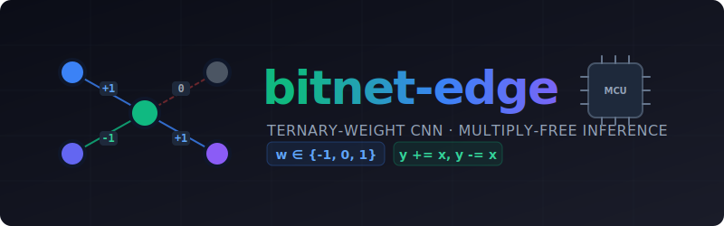

<div align="center">
  
</div>

# bitnet-edge

Ternary-weight CNN training and **multiply-free** bare-metal inference engine for edge devices.

Weights are constrained to **{-1, 0, 1}** during training using a Straight-Through Estimator (STE).
At inference time, convolutions and linear layers become pure **add/subtract/skip** — no multiplication hardware needed.
Each weight is stored in **2 bits** instead of 32, giving **93.75% compression**.

Built from scratch in PyTorch, exported to a custom binary format (`.vbn`), and runs on:
- **Desktop C++** — zero dependencies, single-file engine
- **ESP32-S3** — Arduino sketch, model in flash, inference in SRAM/PSRAM

## Results (MNIST)

| Metric | FP32 Baseline | Ternary (bitnet-edge) |
|---|---|---|
| Test Accuracy | 99.02% | 98.79% |
| Accuracy Drop | — | -0.23% |
| Bits per weight | 32 | 2 |
| Weight memory | 203 KB | 12.7 KB |
| Multiplies at inference | 50,890 | **0** |

### Hardware benchmarks

| Platform | Latency | Throughput |
|---|---|---|
| Desktop (x86, g++ -O2) | 4.97 ms | 201 inf/sec |
| ESP32-S3 (240 MHz, QSPI PSRAM) | 194.9 ms | 5 inf/sec |

## Architecture

```
Input (1x28x28)
  → GroupNorm → TernaryConv2d(1→16, 3x3) → ReLU → MaxPool(2)
  → GroupNorm → TernaryConv2d(16→32, 3x3) → ReLU → MaxPool(2)
  → Flatten
  → LayerNorm → TernaryLinear(1568→128) → ReLU
  → LayerNorm → TernaryLinear(128→10)
  → Argmax
```

## Project structure

```
bitnet-edge/
├── bitnet_edge/                    # Core Python package
│   ├── __init__.py
│   ├── quantize.py                 # STE ternary quantization
│   ├── layers.py                   # VeduBitConv2d, VeduBitLinear
│   └── models.py                   # BaselineCNN, VeduBitNetCNN
│
├── scripts/
│   ├── train.py                    # Train FP32 baseline + ternary model
│   ├── export.py                   # Export trained model to .vbn
│   └── vbn_to_header.py            # Convert .vbn to C header for ESP32
│
├── inference/
│   ├── desktop/
│   │   └── vedu_inference.cpp      # Bare-metal C++ engine (zero deps)
│   └── esp32/
│       └── vedu_esp32/
│           └── vedu_esp32.ino      # Arduino sketch for ESP32-S3
│
├── examples/
│   └── learn_neural_net.py         # Educational: AND gate from scratch
│
├── requirements.txt
├── LICENSE
└── README.md
```

## Quick start

### 1. Train

```bash
pip install -r requirements.txt
python scripts/train.py
```

Trains both the FP32 baseline and the ternary model on MNIST. Saves checkpoints to `checkpoints/`.

### 2. Export

```bash
python scripts/export.py
```

Produces `checkpoints/vedu_model.vbn` (~68 KB) containing ternary-packed weights, biases, normalization parameters, and a test vector.

### 3. Run on desktop (C++)

```bash
cd inference/desktop
g++ -O2 -std=c++17 -o vedu_inference vedu_inference.cpp
./vedu_inference ../../checkpoints/vedu_model.vbn
```

Zero dependencies. Verifies logits match PyTorch to 4 decimal places.

### 4. Deploy to ESP32

```bash
python scripts/vbn_to_header.py              # generates header in esp32 sketch folder

# Compile and upload (ESP32-S3 example)
arduino-cli compile --fqbn "esp32:esp32:esp32s3:CDCOnBoot=cdc,PSRAM=enabled" inference/esp32/vedu_esp32
arduino-cli upload -p COM3 --fqbn "esp32:esp32:esp32s3:CDCOnBoot=cdc,PSRAM=enabled" inference/esp32/vedu_esp32
arduino-cli monitor -p COM3 --config baudrate=115200
```

## How ternary inference works

```
Standard FP32 convolution:
  output += pixel * 0.3847   ← hardware MUL

Ternary convolution:
  if weight == +1:  output += pixel   ← ADD
  if weight == -1:  output -= pixel   ← SUB
  if weight ==  0:  (skip)            ← FREE
```

No multiplication circuit needed. The zero-weights give free sparsity — those inputs are ignored entirely.

## VBN binary format

The `.vbn` file is a self-contained model archive:

| Field | Type | Description |
|---|---|---|
| Magic | `"VBN1"` | Format identifier |
| Layer count | uint32 | Number of layers |
| Per layer: type | uint8 | 0=Conv2d, 1=Linear |
| Per layer: shape | uint32[] | Channels, kernel size, etc. |
| Per layer: weights | uint32[] | 2-bit packed ternary codes |
| Per layer: bias | float32[] | Bias vector |
| Per layer: norm_gamma | float32[] | Normalization scale |
| Per layer: norm_beta | float32[] | Normalization shift |
| Test input | float32[784] | MNIST test image for verification |
| Test label | int32 | Expected prediction |

2-bit encoding: `0 → 0b00`, `+1 → 0b01`, `-1 → 0b10`. 16 weights packed per uint32.

## Citation

This project implements ternary quantization concepts from:

> **The Era of 1-bit LLMs: All Large Language Models are in 1.58 Bits**
> Shuming Ma, Hongyu Wang, Lingxiao Ma, Lei Wang, Wenhui Wang, Shaohan Huang, Li Dong, Ruiping Wang, Jilong Xue, Furu Wei
> Microsoft Research, 2024
> [arXiv:2402.17764](https://arxiv.org/abs/2402.17764)

The original BitNet b1.58 paper targets transformer-based LLMs. This project independently applies the ternary weight concept to convolutional neural networks and builds a complete training-to-edge-deployment pipeline from scratch. **No code was copied from Microsoft's repositories.**

## License

MIT — Copyright (c) 2026 Bhanu Chandar, [Axonyx Quantum Private Limited](https://github.com/bxf1001g)
